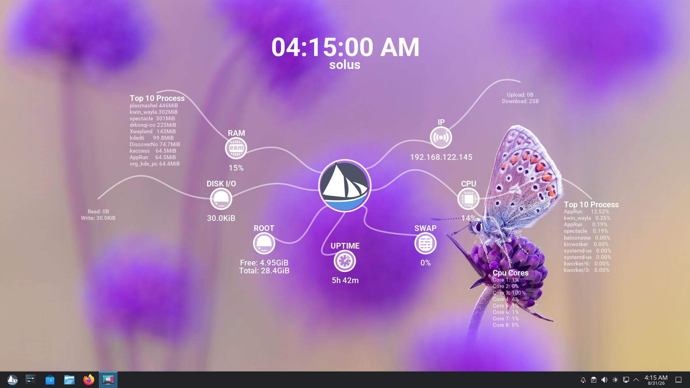
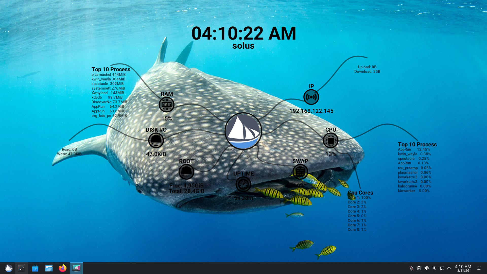
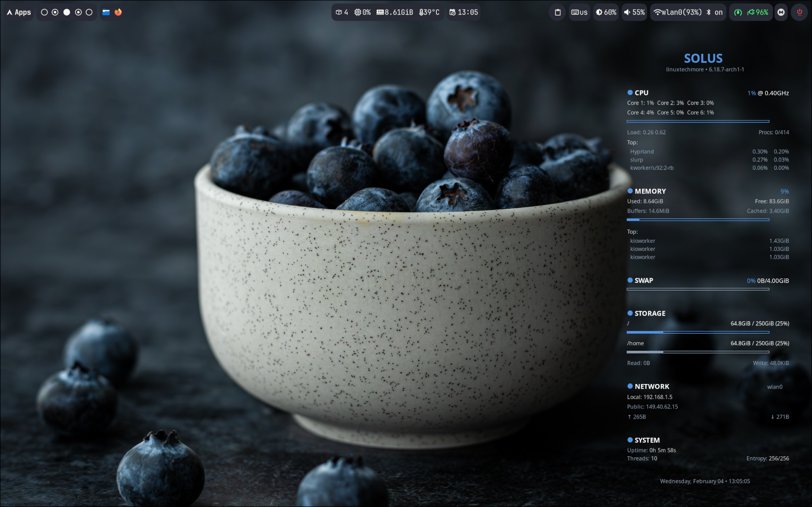

# Distro Conky Themes


[](https://linuxtechmore.com)
[](#%EF%B8%8F-support-the-project)

It began in 2016 as a single custom Conky theme for Solus, the Octopus dashboard. Rebuilt with the latest Lua API and Cairo graphics engine, it now shares the workspace with Pure, a sidebar companion; together they have grown into a universal set for any Linux desktop, with correct layer behavior on both Wayland and X11.

## Supported Distros

| Distro | Logo | Brand Colors | Source |
|---|---|---|---|
| Solus | ✓ | ✓ | [getsol.us/branding](https://getsol.us/branding/) |
| Fedora | ✓ | ✓ | [fedoraproject.org/wiki/Logo](https://fedoraproject.org/wiki/Logo) |
| Arch Linux | ✓ | ✓ | [archlinux.org/art](https://archlinux.org/art/) |
| Ubuntu | ✓ | ✓ | [design.ubuntu.com/brand](https://design.ubuntu.com/brand) |
| Debian | ✓ | ✓ | [debian.org/logos](https://www.debian.org/logos/) |
| openSUSE | ✓ | ✓ | [en.opensuse.org/Artwork_brand](https://en.opensuse.org/openSUSE:Artwork_brand) |
| NixOS | ✓ | ✓ | [nixos.org/branding](https://nixos.org/branding/) |
| Pop!_OS | ✓ | ✓ | [github.com/system76/brand](https://github.com/system76/brand) |
| CachyOS | ✓ | ✓ | [cachyos.org](https://cachyos.org/) |
| Linux Mint | ✓ | ✓ | [linuxmint.com](https://linuxmint.com/) |

*Not your distro? Contributions welcome: see [Adding a New Distro](#adding-a-new-distro).*

## Themes

### Octopus, Dashboard style

The classic Octopus-inspired dashboard with curved arms radiating from a central logo. Features full Lua Cairo graphics for smooth, animated rendering.




- Full Cairo graphics with curved "octopus arms"
- CPU, RAM, SWAP, Disk, Network, and Uptime monitoring
- Top processes and memory consumers
- Dark and Light theme modes
- Resolution-adaptive: the window is sized to your usable screen, so no scale factor is needed
- Native rendering on both X11 and Wayland with Roboto typography

---

### Pure, Sidebar style

A clean, minimalist system monitor designed for both native Wayland compositors and X11 desktops. Uses distro brand colors and Roboto typography.



- **Native X11 and Wayland support** with proper layer-shell / desktop integration
- **Comprehensive stats**: CPU (dynamic per-core detection), Memory (buffers/cached), Swap, Storage, Network (local + public IP), System info
- **Top processes** grouped with their respective sections
- **Resolution-adaptive** to fit any display
- **Distro brand colors**: Each distro gets its official accent color
- Lightweight, no Lua Cairo required

---

## Installation

> [!IMPORTANT]
> **Requirements**
>
> Conky **1.23.0 or newer** is required (`conky_surface()` API for Octopus). The installer fetches a [patched AppImage](https://github.com/sniper1720/conky/releases) with the latest stability and Wayland fixes. Wayland needs `wlr-layer-shell` (Sway, Hyprland, KDE Plasma); GNOME runs as a normal window ([mutter-layer-shell](https://github.com/Caellian/mutter-layer-shell) for desktop-layer placement).
>
> **Noteworthy**: the latest official Conky (1.24.2) has known Wayland issues: desktop-layer placement is broken on KDE Plasma and the binary can crash on exit. The installer fetches a [patched AppImage](https://github.com/sniper1720/conky/releases) built from this project's conky fork, which includes the fixes from upstream PRs [#2431](https://github.com/brndnmtthws/conky/issues/2431) and [#2432](https://github.com/brndnmtthws/conky/pull/2432). This is temporary until those merge.

### Quick Start

The setup script handles everything: **Dependencies, Fonts, Theme Selection, and Configuration**.

```bash
curl -fsSL https://raw.githubusercontent.com/sniper1720/distro-conky-themes/master/setup.sh | bash
```

The installer will:
1. **Detect your distribution** from `/etc/os-release`
2. **Check and install dependencies**: Conky and `curl`
3. **Detect your session type** (X11 or Wayland): both themes support either
4. **Select theme**: Octopus (dashboard) or Pure (sidebar); Pure also asks for sidebar position (left or right)
5. **Apply distro branding**: official logo and brand colors
6. **Configure**: network interface, automatic screen-size detection (both themes are resolution-adaptive), theme mode (dark/light), and desktop layer (X11 users can choose between `normal + below` for right-click support or `desktop` type for Show Desktop visibility)
7. **Set up autostart** (optional)
8. **Uninstall anytime** with the same script

To remove the themes and autostart files, simply run:
```bash
bash ./setup.sh --uninstall
```

---

### Manual Installation

#### 1. Clone and Install

```bash
git clone https://github.com/sniper1720/distro-conky-themes.git
cd distro-conky-themes
./setup.sh local
```

#### 2. Run Manually
```bash
# From installed location (Octopus)
conky -c ~/.config/conky/octopus/conky.conf

# From installed location (Pure)
conky -c ~/.config/conky/pure/conky.conf

# Or directly from repository
conky -c octopus/conky.conf
conky -c pure/conky.conf
```

---

### Configuration

#### Octopus Theme
Edit `~/.config/conky/octopus/settings.lua` after installation:

```lua
local settings = {
    width = 1920,  -- fallback; the installer sets this to your screen size
    height = 1080,
    network_interface = "wlan0",
    theme_mode = "DARK",  -- "DARK" or "WHITE"
    mail_dir = "",  -- Maildir path for ${new_mails}; empty hides the Mail arm
}
```

#### Pure Theme
Edit `~/.config/conky/pure/conky.conf`:

```lua
local network_interface = "wlan0"
```

---

## Adding a New Distro

1. Create `distros/<id>/` directory
2. Build logo from `distros/logo-template.svg` locally: replace the placeholder with the distro's official SVG icon, export to PNG (512×512)
3. Add `logo.png` to the directory (SVG sources stay local, only PNGs are committed)
4. Create `colors.sh` with `COLOR1` (primary/accent), `COLOR2` (secondary), `COLOR3` (tertiary) hex values
5. Add detection rule in `setup.sh` (map `ID` from `/etc/os-release`)
6. Source official brand guidelines URL for reference

### Logo Guidelines
- Use the **logomark/icon only** (no wordmark) for circular display
- Build from `distros/logo-template.svg` (512×512 viewBox): this is a local build tool, not a delivered asset
- Only the exported `logo.png` is committed to the repo
- Respect each distro's trademark/branding policy

---

## ❤️ Support the Project

If you find this theme helpful, there are many ways to support the project:

### Financial Support
If you'd like to support the development financially:

<a href="https://liberapay.com/sniper1720/"></a>
<a href="https://www.buymeacoffee.com/linuxtechmore"></a>
<a href="https://github.com/sponsors/sniper1720"></a>

#### Bitcoin (BTC) Support


```text
1ALZQ6F2CkjQMP8rJrUnXgfVdWwbc6RPYu
```

### Contribute & Support
Financial contributions are not the only way to help! Here are other options:
- **Star the Repository**: It helps more people find the project!
- **Report Bugs**: Found an issue? Open a ticket on GitHub.
- **Suggest Features**: Have a cool idea? Let me know!
- **Share**: Tell your friends!

Every bit of support helps keep the project alive and ensures I can spend more time developing open source tools for the Linux community!

---

## Trademarks

All logos and brand names are trademarks of their respective owners:

- Solus™ is a trademark of Solus Project
- Fedora® is a registered trademark of Red Hat, Inc.
- Arch Linux® is a trademark of Levente Polyák
- Ubuntu™ is a trademark of Canonical Ltd.
- Debian® is a registered trademark of Software in the Public Interest, Inc.
- openSUSE® is a trademark of SUSE LLC
- NixOS® is a trademark of the NixOS Marketing Team
- Pop!_OS™ is a trademark of System76, Inc.
- CachyOS™ is a trademark of CachyOS Project
- Linux Mint® is a registered trademark of Clement Lefebvre

Use of these trademarks does not imply endorsement or sponsorship.

## License

This project is licensed under the **GPL-3.0 License**. See the [LICENSE](LICENSE) file for details.
